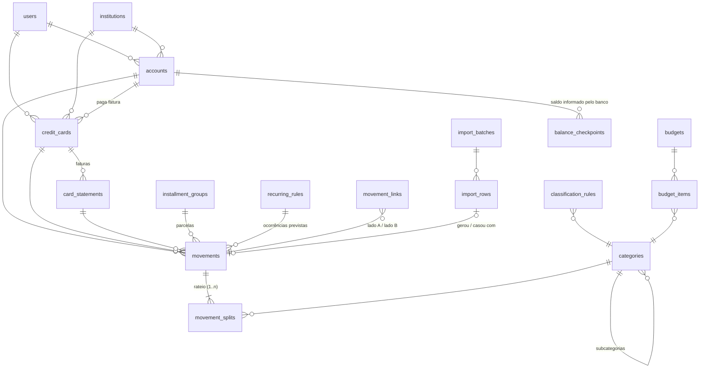

# Proposta Técnica — Controle e Planejamento Financeiro Pessoal (V1)

> Documento de análise (etapa 46 do escopo). Nenhum código foi alterado ainda.
> Depois da sua validação, este documento vira a base de `docs/ARQUITETURA.md` e `docs/REGRAS.md`.

---

## 0. Diagnóstico do que existe hoje

### 0.1 Repositório atual — "Conciliador CAIXA 2026"

| Item | Situação | Decisão |
|---|---|---|
| Stack | HTML + JS puro, estático, sem build | **Substituir.** Não tem backend, banco, autenticação nem validação no servidor, que o escopo exige (seções 1, 40, 41). |
| Persistência | `localStorage` do navegador | Não serve: não sincroniza celular ↔ notebook e se perde ao limpar o navegador. |
| `engine.js` | Parsers do Itaú (datas, números pt-BR, "Parcela X de Y", correção de acentos quebrados), dicionário de classificação, lógica de parcelas | **Aproveitar**: portar para TypeScript dentro dos importadores. É a parte mais valiosa. |
| Testes | `node --test` com fixtures sintéticas | Portar a ideia; os novos testes rodam contra um Postgres real em memória. |
| Vercel | `vercel.json` estático | Será trocado por um projeto Next.js (a Vercel detecta sozinha). |

A troca de stack **não** é preferência pessoal: o app atual foi desenhado para nunca enviar dados a um servidor (`connect-src 'none'`), o oposto do que a V1 precisa.

### 0.2 Arquivos-modelo analisados

**1. Extrato Itaú conta corrente (`.xls`, 3 abas)**
- Aba `Lançamentos`: `data | lançamento | ag./origem | valor (R$) | saldos (R$)`. Cabeçalho na linha 9. Agência e conta (ficam no topo do arquivo e servem para identificar a conta sozinho).
- Linhas `SALDO ANTERIOR` e `SALDO TOTAL DISPONÍVEL DIA` trazem o saldo do banco no fim de cada dia. **Testei: o saldo calculado bate com o do banco em todos os 14 dias do arquivo.** Isso permite conferir automaticamente se faltou ou sobrou lançamento (ver melhoria M1).
- Acentos quebrados (`Tâmilly`, `DISPONÃVEL`): o parser atual já corrige.
- As descrições trazem a data da operação colada (`PIX QRS SERRA DIESE01/09`), que pode ser diferente da data de lançamento (`PIX TRANSF IGREJA 06/09` lançado em 08/09).
- Nomes cortados (`PAY GRATI`, `PAY MINI`): classificar automaticamente é difícil, então esses vão para Pendentes.
- Aba `Posição Consolidada`: saldo em aplicação automática ("poup aut") e limite do cheque especial. Isso é importante para o saldo (ver risco S4).
- Casos reais que o modelo precisa tratar:
  - `FATURA ITAU UNICLASS MC BLA -6.699,92` → pagamento de fatura, **não é despesa**
  - `PIX QRS NU PAGAMENT20/09 -1.693,60` → pagamento da fatura **Nubank**, **não é despesa**
  - `TED 001.3220.ELITON C D +13.524,35` → no CAIXA MENSAL de set/26, isso é Salário 6.500 + Rescisão 7.024,35. É um **rateio** real de entrada.
  - `TED 237.2002.RGE S D D E +320,52` → devolução/reembolso da RGE. Não é salário nem resgate.
  - `PAG BOLETO BANCO BRADESCARD -366,20` → provavelmente o cartão da Tâmilly.
  - `PAG BOLETO ITAU-UNIBANCO HOLDING -1.042,99` → provavelmente uma parcela de empréstimo ou financiamento.

**2. Fatura aberta Itaú Uniclass Black, final 5850 (`.xlsx`)**
- Cabeçalho: cartão `final 5850`, "Valor (parcial)" **4.728,91**, vencimento **07/10/2026**.
- `Data | Lançamento | Parcelamento | Valor | Titularidade | Nome | Tipo do cartão | Número do cartão`.
- Aparecem **vários números de cartão** para a mesma conta: `****5850` (físico), `****8706` (virtual recorrente), `****9849`/`****7858`/`****0415`/`****1404` (virtuais temporários) e `****3884`. Todos pertencem **à mesma fatura**. O cartão é identificado pelo final do título (5850), não pelo número de cada linha.
- Nas parcelas, a data é a **da compra original** (ex.: `2025-03-27 Alis Odontol Parcela 18 de 21`). Isso é ótimo para montar a série de parcelas.
- `Pagamento Debito Automatico -6.699,92` (08/09) aparece nesta fatura, mas quita a fatura **anterior**. É o mesmo evento do extrato. **Conferi: a soma das compras (sem o pagamento) = 4.728,91 = valor informado pelo banco.**
- As datas vêm como meia-noite UTC. Se forem convertidas ingenuamente para o fuso de Brasília, **voltam um dia** (risco S3).
- Aviso do próprio banco: compras recentes podem demorar 48h para aparecer, e uma compra parcelada pode aparecer primeiro com o valor cheio e só depois dividida. Isso afeta a deduplicação da fatura aberta (risco D5).

**3. Nubank cartão (`.csv`)**
- `date,title,amount`, com valor em formato brasileiro e **espaço no sinal** (`"- 1.693,60"`).
- `Pagamento recebido -1.693,60` (20/09) é **o mesmo evento** do `PIX QRS NU PAGAMENT` no extrato Itaú. É o exemplo perfeito do vínculo conta ↔ cartão.
- Parcelas vêm como `Panvel*Digital - Parcela 3/4`, e **todas com a mesma data** (a do ciclo, não a da compra). Por isso a chave de deduplicação do Nubank precisa ser diferente da do Itaú.

**4. Sua planilha `CAIXA 2026`**
- `CAIXA MENSAL`: a árvore de categorias é **idêntica** à da seção 7 do escopo, com colunas PREVISTO/REALIZADO por mês de 2026, 2027 e 2028. O "PREVISTO" da planilha é, na prática, o **ORÇADO**.
- O REALIZADO das saídas é `SUMIFS` sobre `CASH` e `CARTÃO` pela coluna **MÊS_VENC**. Ou seja, **hoje você já trabalha com compras de cartão caindo no mês do vencimento da fatura** (decisão D1).
- As entradas realizadas são digitadas à mão no CAIXA MENSAL (não existem em CASH).
- `CASH`: cerca de 414 linhas com dados. `CARTÃO`: cerca de 740 (Itaú Black 590, Nubank 147). Muitas linhas usam o dia 1º como data (lançamentos mensais agregados).
- `Resgate` aparece em Entradas > Bancário **e** como valor negativo em Saídas > Poupança. `Empréstimo` (4.147,18 em jul/26) aparece como entrada, e as parcelas aparecem como saída. É exatamente a distorção que o novo modelo resolve (decisão D2).
- Saldo inicial de jan/26: **R$ 1.642,82**.

---

## 1. Arquitetura proposta

```
 Celular / Notebook (navegador ou PWA instalada)
          │  HTTPS, cookie de sessão httpOnly
          ▼
 ┌──────────────────────── Vercel ────────────────────────┐
 │ Next.js (App Router, TypeScript)                        │
 │  • Telas: React Server Components + componentes cliente │
 │  • Mutações: Server Actions + Route Handlers (upload)   │
 │  • Middleware: exige sessão em todas as rotas privadas  │
 │  • Domínio (lib/domain): regras financeiras puras       │
 │  • Importadores (lib/importers): 1 módulo por formato   │
 │  • Vercel Cron: gera recorrências e amplia o horizonte  │
 └──────────────────────────┬──────────────────────────────┘
                            │ TLS (driver serverless)
                            ▼
              Postgres gerenciado — Neon
     (banco principal + "branch" separado para homologação)
```

| Camada | Escolha | Por quê |
|---|---|---|
| Frontend | **Next.js 15 + React + TypeScript** | É o padrão da Vercel e junta front e back num único projeto e deploy. |
| UI | **Tailwind CSS + componentes Radix/shadcn** (bottom sheet, dialog, select acessíveis), ícones Lucide | Mobile first, alvos de toque grandes, tema claro/escuro, identidade própria. |
| Gráficos | **Recharts** | Leve e responsivo. Cada ponto do gráfico é clicável para o drill-down. |
| Formulários/validação | **Zod** (mesmo schema valida no cliente **e** no servidor) + React Hook Form | O servidor sempre revalida (seção 41). |
| Banco | **PostgreSQL no Neon**, contratado pelo painel da Vercel (Storage → Neon) | Persistente, com plano gratuito suficiente. As variáveis são injetadas automaticamente em Production e Preview. Tem *branching*, que dá um banco separado para homologação. |
| ORM/migrations | **Drizzle ORM + drizzle-kit** (migrations SQL versionadas no git) | Leve em serverless, SQL explícito e bom para consultas agregadas. |
| Autenticação | **Sessão própria**: e-mail + senha (hash argon2id), token opaco em cookie `httpOnly`/`Secure`/`SameSite=Lax`, sessões guardadas no banco, limite de tentativas de login, cadastro fechado (o usuário é criado por script com variáveis de ambiente) | Simples e sem dependência externa. Dá para evoluir para 2FA/passkey e para multiusuário (toda tabela já tem `user_id`). |
| Importação | Upload para Route Handler (Node). Parsing **no servidor** com SheetJS 0.20.x (a versão 0.18.5 do npm tem vulnerabilidades conhecidas), parser CSV e parser OFX próprio | O arquivo é validado no backend (tamanho, extensão, assinatura binária). Nada depende do navegador. |
| Hospedagem | **Vercel**: `main` → Produção, outras branches → Preview (homologação) | É o que o escopo pede. Já existe um `VERCEL_TOKEN` neste ambiente, que funciona. |
| PWA | Manifest + ícones + service worker mínimo | **Vale a pena na V1**: é simples. O service worker guarda só o "casco" do app (JS/CSS/ícones) e **nunca** guarda dados financeiros. |
| Testes | **Vitest** (regras de domínio contra Postgres real em memória via PGlite) + **Playwright** (telas em 390px e 1366px) | Os 9 testes obrigatórios da seção 49 viram testes automatizados. |

### Importadores (plugáveis)

```ts
interface Importer {
  id: 'itau-extrato-xls' | 'itau-fatura-xlsx' | 'nubank-fatura-csv' | 'ofx' | ...
  detect(file): { confidence: number; holderHint?: {agencia, conta} | {cardLast4} }
  parse(file): { period, reportedBalances?, statementInfo?, rows: CanonicalRow[] }
  dedupKey(row, ctx): string        // cada formato define sua própria chave
}
```

Todos produzem `CanonicalRow` (data, descrição, valor em centavos, parcela n/N, id externo, dados brutos). A partir daí o pipeline é **único**: deduplicação → classificação → prévia → confirmação. Para adicionar Sicredi, Mercado Pago ou OFX basta criar um arquivo novo. No futuro, Open Finance será só mais uma **fonte** que gera `CanonicalRow`, sem mudar nada no resto.

---

## 2. Modelo de dados

Convenções:
- **Dinheiro sempre em centavos inteiros** (`bigint`). Nunca `float`.
- Datas de negócio em `date`, sem fuso horário. Datas técnicas em `timestamptz`.
- Toda tabela tem `user_id`, `created_at` e `updated_at`.
- Cadastros usam `is_active`: não há exclusão física quando existem vínculos.
- Movimentos usam `deleted_at` (exclusão lógica com auditoria).



### Entidades principais

| Tabela | Campos-chave | Observações |
|---|---|---|
| `users`, `sessions` | e-mail, hash da senha; token (hash), expiração | |
| `institutions` | nome, código COMPE, ativo | Seed: Itaú, Sicredi, Nubank, Mercado Pago, Caixa, BB, Bradesco, Santander, Inter, C6, "Dinheiro". |
| `accounts` | instituição, nome, tipo (`CHECKING, SAVINGS, DIGITAL, INVESTMENT, WALLET, CASH, OTHER`), agência, número, **saldo inicial + data do saldo inicial**, `in_available_balance`, ativo | O saldo é calculado, nunca digitado. `in_available_balance` define o que entra no **Saldo Consolidado disponível**. Investimentos entram no patrimônio, não no disponível. |
| `credit_cards` | nome, instituição, bandeira, final, finais adicionais (cartões virtuais), limite, dia de fechamento, dia de vencimento, conta de pagamento, padrões de descrição do pagamento (`FATURA ITAU UNICLASS`, `NU PAGAMENT`), ativo | |
| `card_statements` (**faturas**) | cartão, mês de vencimento, **data real de fechamento**, **data real de vencimento**, total informado pelo banco, status | Entidade própria (melhoria M2). As datas reais podem ser ajustadas, por exemplo quando o vencimento cai em feriado. |
| `categories` | `parent_id` (nulo = categoria, preenchido = subcategoria), nome, **`nature`**, grupo visual (`ENTRADAS`/`SAÍDAS`), ordem, `is_system`, ativo | Uma tabela só, com hierarquia de 2 níveis. A **natureza econômica fica na subcategoria**, o que permite Poupança > Aporte ≠ Poupança > Rendimento. |
| `movements` (**lançamentos**) | conta **ou** cartão (exatamente um dos dois); fatura (se cartão); **valor com sinal**; data; competência; vencimento; data de pagamento; descrição original; descrição normalizada; status (`PLANNED` = previsto, `REALIZED` = realizado, `CANCELLED`); origem (`MANUAL, IMPORT, RECURRING, INSTALLMENT, MIGRATION`, futuramente `OPEN_FINANCE`); lote/linha de importação; id externo; **chave de deduplicação**; parcela (grupo, n, N); regra recorrente; observação; `version` | **Índice único** (portador + chave de dedup) entre os não excluídos. **O banco recusa fisicamente uma duplicata**, mesmo que o código erre. |
| `movement_splits` (**rateio**) | movimento, subcategoria (nula = pendente), valor, `person_id` (futuro) | **Todo** movimento tem de 1 a n rateios, e a classificação vive sempre aqui. Um trigger no Postgres (verificado no fim da transação) garante **soma dos rateios = valor do movimento**. |
| `movement_links` | tipo (`TRANSFER`, `CARD_PAYMENT`, `INVESTMENT`), movimento A, movimento B | Liga os dois lados de uma transferência, aporte ou pagamento de fatura. |
| `installment_groups` | portador, descrição, data da compra, valor total, nº de parcelas, valor da parcela | Todas as parcelas apontam para o grupo. |
| `recurring_rules` | descrição, valor, conta/cartão, subcategoria, frequência (`WEEKLY, BIWEEKLY, MONTHLY, YEARLY, CUSTOM` com intervalo), início, fim, dia de vencimento, tolerância de valor, padrão de descrição para casar com o realizado | Gera movimentos `PLANNED` para os próximos 13 meses. |
| `budgets` / `budget_items` | ano; (categoria ou subcategoria, mês, valor) | |
| `import_batches` | arquivo, SHA-256, importador, instituição, conta/cartão, fatura, período, contagens (lidos, válidos, duplicados, classificados, pendentes, erros, importados), saldo informado × saldo calculado, status (`DRAFT, COMMITTED, DISCARDED, REVERTED`), datas | Guarda o histórico completo. |
| `import_rows` | lote, nº da linha, **dados brutos (jsonb)**, campos interpretados, chave, situação (`NEW, DUPLICATE, MATCHED_PLANNED, POSSIBLE_DUPLICATE, IGNORED, ERROR`), sugestão + confiança + regra usada, movimento criado ou casado | Rastreabilidade linha a linha. |
| `classification_rules` | padrão, tipo (`CONTAINS, STARTS_WITH, EXACT, REGEX`), filtro opcional (conta/cartão, sentido, faixa de valor), subcategoria, prioridade, origem (`SYSTEM, USER, LEARNED`), contagem de acertos, ativo | |
| `balance_checkpoints` | conta, data, saldo informado, origem | Vêm dos saldos diários do extrato ou são digitados. |
| `audit_events` | entidade, id, ação, campo, valor anterior, valor novo, contexto (tela, lote), data/hora | Histórico de edição (seção 14). |
| `people` | nome | **Tabela criada já na V1, sem tela.** `movement_splits.person_id` fica pronto para "Pessoa: Tâmilly". |

### Natureza × direção

- **Direção** vem do sinal do valor no portador: `+` = INFLOW, `−` = OUTFLOW. Quando os dois lados estão ligados entre portadores seus, o par é NEUTRAL no consolidado. A direção é calculada, não digitada, então não pode ficar inconsistente com o valor.
- **Natureza** vem da subcategoria:

| Natureza | Subcategorias do seed | Entra em "Receitas/Despesas"? |
|---|---|---|
| `INCOME` | CLT/*, Extras/*, Outras Receitas/*, **Poupança > Rendimento** (marcada como receita financeira) | Receita |
| `EXPENSE` | Moradia … Pet, Tâmilly, Outros, Despesas Bancárias | Despesa |
| `INVESTMENT` | Poupança > Aporte, Poupança > Resgate, Bancário > Resgate | Não. Aparece em "Valor poupado" |
| `TRANSFER` | Poupança > Transferência entre contas, *Pagamento de fatura* (sistema, oculta) | Não |
| `FINANCING` | Bancário > Empréstimo, Financiamentos/* (ver **D2**) | Não é receita nem consumo. Aparece em "Dívidas" e no comprometimento da renda |
| `ADJUSTMENT` | Ajuste de Saldo > Correção manual | Não |

---

## 3. Regras financeiras

### 3.1 Duas visões sobre os mesmos dados
- **Caixa**: movimentos **realizados em contas** (não em cartões), pela data. É o dinheiro que entrou ou saiu de verdade. A compra no cartão **não** entra no caixa; o pagamento da fatura entra.
- **Econômica (Receita/Despesa)**: rateios com natureza INCOME/EXPENSE, pela **competência**. Inclui as compras no cartão. **Exclui** transferências, pagamento de fatura, aportes, resgates, empréstimos e ajustes.
- Essa separação é o que impede toda duplicação cartão × conta: cada visão só olha para um dos lados.

### 3.2 Cartão de crédito
- **Compra** = movimento no **cartão**, valor negativo (aumenta a dívida), natureza EXPENSE, ligado a uma **fatura**.
- **Fatura da compra** (lançamento manual): a fatura é a primeira cujo **fechamento é posterior à data da compra**. Uma compra **no próprio dia do fechamento** vai para a fatura seguinte, que é a regra do "melhor dia de compra" (as datas reais ficam editáveis na fatura). No seu exemplo (fecha 10, vence 17): compra no dia 08 → fatura atual; no dia 12 → próxima.
  - Fechamento da fatura do mês M: se fechamento < vencimento, dia F de M; senão, dia F de M−1. É o caso do Itaú Black, que vence dia 7.
- **Na importação, a fatura do arquivo manda**: as linhas do arquivo pertencem àquela fatura, qualquer que seja o cálculo.
- **Pagamento de fatura** = **dois movimentos ligados** (`CARD_PAYMENT`): saída na conta (−6.699,92 Itaú) ↔ crédito no cartão (+6.699,92). A subcategoria é o sistema "Pagamento de fatura" (TRANSFER). **Nunca é despesa.** O pagamento abate a fatura que ele quita, e não a fatura em cujo arquivo ele aparece.
  - Se só um lado foi importado, ele fica marcado "aguardando contraparte". Quando o outro arquivo chegar, a linha **casa** com ele em vez de virar lançamento novo.
  - Aceita pagamento parcial: status `PARCIALMENTE PAGA`, com saldo remanescente.
- **Limite utilizado** = compras não pagas **+ parcelas futuras** (o banco bloqueia o valor total da compra parcelada). Disponível = limite − utilizado.
- **Estorno** (valor positivo no cartão, que não é pagamento) reduz a despesa na **mesma subcategoria** da compra. Não é receita.
- **Impacto no caixa**: a fatura inteira sai da conta de pagamento **na data de vencimento**.

### 3.3 Parcelamentos
- `installment_groups` + parcelas `n/N` como movimentos independentes. Cada parcela cai em uma fatura (mês de vencimento consecutivo).
- Lançamento manual de R$ 1.200 em 6x: 6 parcelas de R$ 200. Se não for exato, a diferença de centavos fica na **1ª parcela** (padrão dos bancos brasileiros). Exemplo: 100/3 = 33,34 + 33,33 + 33,33. A soma sempre fecha com o total.
- Importação de "Parcela 3 de 10": cria o grupo, a parcela 3 como **REALIZADA** e as parcelas **4 a 10 como PREVISTAS** nas faturas seguintes, cada uma já com sua chave de deduplicação. Quando a fatura seguinte chega, "Parcela 4 de 10" **casa com a prevista e a realiza**, sem criar outra. As parcelas 1 e 2 (anteriores) não são criadas, a menos que o histórico já as tenha.
- Classificar a compra propaga a categoria para todas as parcelas do grupo que ainda não foram editadas individualmente.

### 3.4 Transferências, aportes, resgates, empréstimos
- **Transferência entre contas próprias** = par ligado (−1.000 Sicredi ↔ +1.000 Itaú). Patrimônio consolidado **não muda**. Nada entra em receita ou despesa.
- **Detecção automática**: uma saída X na conta A e uma entrada X na conta B com até 3 dias de diferença, e descrição de transferência ou nome do titular, viram uma **sugestão** de vínculo. Nunca são ligadas às cegas.
- **Aporte**: se a conta de investimento é controlada, é um par ligado (conta corrente − / investimento +). Se não é, é um movimento único de natureza INVESTMENT. Nos dois casos **não é despesa** e aparece em "Valor poupado".
- **Resgate**: o inverso. **Não é receita.**
- **Rendimento**: receita financeira (INCOME).
- **Empréstimo recebido**: FINANCING (entrada). Aumenta o caixa e **não é renda**.

### 3.5 Rateio
- Todo movimento tem ≥ 1 rateio. O trigger do banco garante que a soma dos rateios é igual ao valor. A tela só deixa salvar quando "falta distribuir" chega a R$ 0,00.
- Exemplo real: TED de 13.524,35 = Salário 6.500 + Rescisão 7.024,35.

### 3.6 Competência × caixa
- `competence_month` em todo movimento. Os padrões são:
  - Conta: mês da data.
  - Cartão: **mês do vencimento da fatura** (é como sua planilha faz hoje, ver D1).
  - Recorrência/prevista: mês do vencimento.
- A competência é editável, como no exemplo do salário de set pago em out.

### 3.7 Orçado × Realizado × Previsto × Realizado+Previsto
- **Orçado** = `budget_items` do mês. A comparação se faz no nível em que o orçamento foi definido (categoria ou subcategoria).
- **Realizado** = rateios de movimentos `REALIZED` com competência no mês.
- **Previsto** = movimentos `PLANNED` com competência no mês: ocorrências de recorrência ainda não casadas, parcelas futuras, lançamentos previstos manuais. Previstos **vencidos** (data já passou, ainda sem realizado) continuam contando e aparecem com o alerta "confirmar".
- **R+P** = Realizado + Previsto. **Desvio projetado** = R+P − Orçado.
- **Ao realizar, o previsto sai.** A importação casa o real com o previsto (recorrência, parcela, contraparte), e o previsto é "consumido". É isso que evita contar duas vezes.

### 3.8 Deduplicação (prioridade nº 1)
Em camadas:
1. **Id original da instituição** (FITID do OFX etc.), quando existe: chave `ext:<portador>:<id>`.
2. **Chave por formato + índice de ocorrência** quando não existe id:
   - Extrato Itaú: `conta | data | valor | descrição normalizada | seq`
   - Fatura Itaú: `cartão | data da compra | descrição | valor | n/N | seq`
   - Nubank CSV: `cartão | descrição sem "Parcela" | valor | n/N | (data, se à vista) | seq`

   `seq` é a posição da linha entre as linhas **idênticas no mesmo arquivo**. Duas compras legítimas iguais (mesmo dia, valor e descrição) recebem seq 1 e 2, e **as duas entram**. O mesmo arquivo importado de novo gera as mesmas chaves e **nada entra**. Arquivos com períodos sobrepostos resolvem o mesmo jeito, porque o dia inteiro aparece nos dois. Se um arquivo posterior tiver uma ocorrência a mais do mesmo lançamento, só **a nova** entra.
3. **Previsto correspondente**: a linha casa com uma parcela, recorrência ou contraparte prevista e **a realiza** em vez de criar outra.
4. **Possível duplicado** (heurística): mesmo portador, mesmo valor, datas com até 3 dias de diferença, vindo de **outra fonte** (lançamento manual ou outro formato de arquivo). A linha não é descartada nem importada sozinha: vai para revisão com as opções "vincular ao existente" ou "é outro lançamento".
5. **Arquivo idêntico** (mesmo SHA-256): aviso "já importado em DD/MM (lote #N)". A prévia mostra 100% duplicados.
6. **No banco**: índice único + confirmação do lote em **uma transação**, com `INSERT … ON CONFLICT DO NOTHING` e trava do lote. Um duplo clique em "Confirmar" não duplica nada.

---

## 4. Estrutura das telas

### 4.1 Mobile (principal) — navegação inferior

```
┌─────────────────────────────┐
│  Saldo disponível  👁        │  ← abre direto aqui
│  R$ 237,90                  │
│  ⚠ 12 para classificar  ›   │
├─────────────────────────────┤
│  …conteúdo em cards…        │
├─────────────────────────────┤
│ Início  Movim.  (+)  Orçam.  Mais │
└─────────────────────────────┘
```

- **Início | Movimentos | ( + ) | Orçamento | Mais**. É a sua sugestão, que considero a melhor. O badge de pendentes fica em Movimentos e no banner do Início.
- **( + )** abre uma folha inferior com: Despesa · Receita · Transferência · Compra no cartão (parcelável) · Pagamento de fatura · Importar arquivo · Ajuste de saldo.
- **Mais**: Cartões · Contas · Importações · Pendentes · Projeção · Recorrências · Cadastros (Categorias, Regras, Bancos) · Configurações · Sair.

**Início** (nível 1, sem poluir):
1. Saldo disponível consolidado, com o **olho para ocultar valores** (uso em público).
2. Banner "X para classificar →".
3. Resultado do mês: Receitas · Despesas · Resultado. Um toque alterna Econômico ↔ Caixa.
4. Orçamento do mês: uma barra (realizado sólido, previsto hachurado, marcador do orçado), o desvio projetado e as 3 categorias com maior desvio.
5. Cartões: carrossel com fatura atual, vencimento e limite disponível.
6. Projeção: saldo em 30/60/90 dias e **menor saldo previsto** (com a data).
7. "Ver análises" leva ao nível 2: gráficos, comprometimento da renda, valor poupado, despesas que mais cresceram, recorrentes.

**Movimentos**: busca fixa no topo e chips de filtro (mês, conta/cartão, categoria, status, pendentes, previstos). A lista é agrupada por dia, com total do dia e **rolagem infinita paginada no servidor**. Um toque abre a folha de detalhe: editar, **ratear**, ver histórico, ver as parcelas do grupo e o vínculo. Um toque longo entra em seleção múltipla para classificar em lote.

**Novo lançamento**: primeiro o valor (teclado numérico grande), depois descrição, subcategoria (chips das recentes + busca), conta/cartão (lembra o último) e data (hoje), com parcelas quando for cartão. **4 a 5 toques.**

**Pendentes** (modo triagem): um cartão por lançamento, com um botão grande **"✓ Sugestão"**, chips das subcategorias mais usadas e o botão "Aplicar a semelhantes" já ligado. Tem também a aba **"Agrupados"**: `PAY MINI (4)`, `SERRA DIESE (7)`. Um toque classifica o grupo inteiro.

**Orçamento**: seletor de mês e lista de categorias com a barra O/R/P e o desvio. Tocar na categoria mostra as subcategorias, e tocar de novo mostra os lançamentos (drill-down). Para editar: por categoria, lista de meses com "aplicar aos meses seguintes".

**Cartões**: fatura atual (total, fechamento, vencimento, status), próximas faturas (barras dos próximos 6 meses), limite (usado × disponível), parcelamentos em andamento.

**Importar**: botão "Escolher arquivo", que abre o seletor nativo do celular (Arquivos, Drive, Downloads). Depois vêm a identificação automática, a prévia em cards e o botão Confirmar.

Nenhuma tela tem scroll horizontal. Tabelas viram cards/listas abaixo de 768px.

### 4.2 Desktop / notebook
- **Barra lateral** fixa com todos os módulos. O conteúdo ocupa toda a largura.
- **Dashboard** em grade de 3 a 4 colunas, com todos os cards de indicadores e gráficos lado a lado e filtros globais (período, conta, cartão, categoria, subcategoria).
- **Movimentos** em **tabela completa**: colunas configuráveis, filtros avançados na lateral, **edição em lote** (categoria, competência, conta), exportação CSV.
- **Orçamento** em **grade anual editável estilo planilha** (Categoria × Jan…Dez), com os botões O/R/P/R+P, copiar do ano anterior e aplicar para os meses seguintes. Os totais do mês e do ano são o que você já faz no CAIXA MENSAL.
- **Importações**: prévia em tabela com a linha bruta ao lado da interpretada e o histórico de lotes.
- **Cadastros**: tabelas com ativar/inativar.

---

## 5. Fluxo de importação

```
Upload ─► Identificação ─► Leitura ─► Validação ─► Deduplicação ─► Classificação ─► Prévia/Revisão ─► Confirmação
 (≤4MB,    (cada importador   (Canonical   (datas, valores,  (camadas 1–5     (regras do usuário  (lote DRAFT     (transação única:
 extensão,  dá uma nota;       Row)         período, total    da seção 3.8)     → sistema →         salvo no banco; cria/realiza
 assinatura agência/conta ou                da fatura ×                         histórico; confiança usuário revisa, movimentos, liga
 binária,   final do cartão                 informado;                          baixa → pendente)   ajusta, exclui   pares, confere
 SHA-256)   → conta/cartão)                 saldos diários)                                         linhas)          saldos → COMMITTED)
```

- A **prévia é salva no banco** (lote `DRAFT`), porque na Vercel não existe memória entre requisições. Dá para sair e voltar depois.
- A prévia mostra: encontrados · válidos · duplicados · casados com previstos · classificados · pendentes · possíveis duplicados · erros. Também mostra, conforme o arquivo, "✔ total da fatura confere (4.728,91)" e "✔ saldo confere com o banco em 23/09".
- **Depois de confirmar**: os pendentes vão para a tela Pendentes, o lote fica no histórico e é possível **desfazer o lote**. Desfazer só remove os movimentos daquele lote que não foram editados ou vinculados depois; os que foram são avisados um a um.
- Se o arquivo não for reconhecido, a mensagem é clara e mostra os formatos suportados. Na V2 entra um importador CSV genérico com mapeamento de colunas.

---

## 6. Riscos identificados e mitigação

| # | Risco | Onde pode acontecer | Mitigação |
|---|---|---|---|
| D1 | Reimportar o mesmo arquivo | Uso normal | Chave + seq + índice único (3.8) |
| D2 | Períodos sobrepostos | Extratos de 01–15 e 10–25 | Chave por dia + seq |
| D3 | Duas compras legítimas idênticas | 2× "PAY MINI 17/09 −17,00" no mesmo dia (acontece no seu extrato) | `seq` preserva as duas. Nunca se deduplica só por data+valor, como o conciliador atual fazia na conta |
| D4 | Lançamento manual e depois importado | Você lança no celular e depois importa o extrato | Camada 4: "vincular ao existente", mantendo a sua categoria |
| D5 | Fatura aberta importada várias vezes no mês | A compra aparece cheia e depois parcelada, ou somem estornos | Linha que existia na importação anterior da **mesma fatura aberta** e sumiu na nova vira o alerta "alterada/estornada?", para revisar. Nada é apagado sozinho |
| D6 | Parcelas do Nubank com a mesma data | CSV Nubank | Chave específica do formato (sem data da compra) |
| D7 | Mesmo evento em dois arquivos | Pagamento de fatura no extrato **e** na fatura; transferência nos dois bancos | Pares ligados (`movement_links`) e contraparte "aguardando" |
| S1 | Saldo inicial errado | Implantação | Saldo inicial com data. Sugestão automática a partir do `SALDO ANTERIOR` do primeiro extrato |
| S2 | Lançamento faltando ou sobrando | Arquivo incompleto | **Checkpoints diários do extrato** (M1): a diferença aparece na hora, com a data em que começou |
| S3 | Data deslocada em 1 dia | A fatura Itaú vem em UTC 00:00 | Datas tratadas como data de calendário (sem fuso), com teste específico |
| S4 | Aplicação automática Itaú ("poup aut") | O saldo do extrato inclui a aplicação automática | A V1 trata "Itaú CC + aplicação automática" como **uma** conta (é o que o saldo do extrato mostra). Opcionalmente, uma conta de investimento separada no futuro |
| S5 | Arredondamento | Centavos | Inteiros em centavos, sem float em lugar nenhum |
| C1 | Pagamento de fatura contado como despesa | Extrato | Padrões de pagamento cadastrados por cartão (`FATURA ITAU UNICLASS`, `NU PAGAMENT`), com natureza TRANSFER e vínculo à fatura |
| C2 | Pagamento que não bate com a fatura | Pagamento parcial, juros, rotativo | Status parcialmente paga, saldo remanescente e encargos como despesa bancária |
| C3 | Vencimento ou fechamento deslocado | Feriados (07/09/2026 → pago em 08/09) | Datas reais editáveis na fatura. Casamento com tolerância de ±5 dias |
| C4 | Vários números de cartão na mesma fatura | Virtuais do Itaú | O cartão é identificado pelo título da fatura, e os finais adicionais ficam guardados |
| K1 | Palavra-chave ampla demais | `TIM` × `TIMY ALIMENTOS`, `POSTO` | Padrões mais longos ganham prioridade, escopo por sentido (entrada/saída), a regra aplicada fica visível e dá para desfazer |
| K2 | Entrada classificada errado | TED do próprio nome = salário? reembolso RGE? | **Entradas nunca são classificadas por palavra genérica.** Só por regra forte criada por você. O resto vai para pendentes |
| K3 | Nomes truncados | `PAY GRATI`, `PAY MINI` | Pendentes agrupados + "aplicar a semelhantes" |
| B1 | Previsto contado junto com o realizado | Recorrência de Netflix + cobrança real | Casamento automático (valor ±10%, data ±5 dias, padrão). Previsto vencido e não casado gera alerta |
| B2 | Convenção de competência | Cartão por compra × por vencimento | Decisão D1, uma regra única e documentada |
| B3 | Dinheiro não classificado some do orçamento | Pendentes | Dashboard mostra "R$ X ainda não classificado" ao lado dos totais |
| B4 | Orçamento em categoria × subcategoria | Grade anual | Totalização explícita, com aviso quando a soma das subcategorias passa da categoria |
| P1 | Perda de dados | Erro ou exclusão | Exclusão lógica + auditoria + backups do Neon + exportação completa (JSON/CSV) nas Configurações |
| P2 | Segurança | Dados financeiros | Sessão httpOnly, cadastro fechado, limite de tentativas, CSP, validação Zod no servidor, secrets só em variáveis de ambiente, service worker sem dados |

---

## 7. Melhorias que proponho (não estavam no escopo)

| # | Melhoria | Valor | Na V1? |
|---|---|---|---|
| M1 | **Conciliação automática de saldo** pelos saldos diários do extrato | Detecta duplicidade ou falta de lançamento na hora. Já testado no seu arquivo: bate 14/14 dias | Sim |
| M2 | **Fatura como entidade** (datas reais, total do banco × total calculado, status de pagamento) | Fecha o ciclo cartão ↔ conta | Sim |
| M3 | **Migração do CAIXA 2026** (ver D3) | Você não começa do zero: histórico 2026, orçamento 2026/2027 e regras | Sim, se aprovar |
| M4 | **Motor único "previsto → realizado"** (parcela, recorrência, contraparte) | Evita a principal fonte de contagem dupla do planejamento | Sim |
| M5 | **Desfazer lote de importação** | Erro de importação sem trabalho manual | Sim |
| M6 | **Modo privacidade** (ocultar valores) | Uso no celular em público | Sim |
| M7 | **"Menor saldo previsto"** na projeção | Mostra com antecedência quando o caixa fica negativo (seu extrato ficou negativo em set) | Sim |
| M8 | **Estimativa de gastos variáveis** na projeção (usa o orçamento restante ou a média de 3 meses para categorias sem recorrência) | Sem isso a projeção fica otimista demais (mercado, combustível etc. não são "conhecidos") | Sim, como opção que se liga e desliga |
| M9 | **Dimensão Pessoa** já no banco (sem tela) | "Tâmilly" deixa de ser categoria no futuro sem migração dolorosa | Só a estrutura |
| M10 | **Homologação real**: previews da Vercel usando um branch separado do banco | Testar sem mexer nos dados de produção | Sim |
| M11 | Exportação completa dos dados | Você nunca fica preso ao app | Sim |
| M12 | 2FA / passkey, notificações de vencimento, OCR, Open Finance | Evolução | V2+ (a arquitetura já comporta) |

---

## 8. Decisões que preciso de você

| # | Pergunta | Minha recomendação |
|---|---|---|
| **D1** | Compra no cartão entra no orçamento/competência de qual mês? | **Mês do vencimento da fatura**, como o seu CAIXA 2026 já faz. A data da compra continua registrada e filtrável. |
| **D2** | Parcelas de **Financiamentos** (veículo, empréstimo): despesa comum ou "serviço de dívida"? | **Natureza FINANCING**: aparecem no orçamento, no fluxo de caixa e no **comprometimento da renda**, mas em uma linha própria ("Dívidas"), separadas do **consumo**. O Empréstimo recebido não entra como renda. O "Resultado do mês" mostra Receitas − Despesas − Dívidas. |
| **D3** | Migrar o CAIXA 2026? Se sim, a partir de quando os arquivos do banco passam a mandar? | **Sim.** Histórico da planilha **até 31/08/2026** (CASH → conta Itaú, CARTÃO → cartão indicado), orçamento 2026/2027 (colunas PREVISTO) e entradas realizadas mensais. Os saldos da conta partem do `SALDO ANTERIOR` do extrato (31/08/2026 = −586,95). A partir de 01/09 valem só os arquivos, o que evita duplicar. |
| **D4** | Contas e cartões iniciais | Vou pré-cadastrar: **Itaú Conta Corrente**, **Itaú Uniclass Black final 5850** (vence dia 7), **Nubank** (cartão), Dinheiro. **Preciso de**: dia de fechamento do Itaú Black e do Nubank, vencimento do Nubank, limites, e se existem outras contas (Sicredi? Mercado Pago? conta Nubank?). |
| **D5** | Login | E-mail + senha, só você (usuário criado na implantação). Se preferir, "Entrar com Google" (dá mais trabalho de configuração). |
| **D6** | Banco de dados | **Neon Postgres pela Vercel** (gratuito). Vou tentar criar tudo via API com o token que já existe aqui. Se a Vercel exigir aceite de termos no painel, peço 1 clique seu. |
| **D7** | O conciliador atual | Substituído pelo novo app (fica no histórico do git). |

---

## 9. Plano de implementação da V1

Entrega **incremental e publicada desde o 1º dia** ("esqueleto andando" em produção). Cada etapa termina com deploy na Vercel.

| Etapa | Conteúdo | Depende de |
|---|---|---|
| **E0 — Fundação** | Next.js + TS + Tailwind; schema Drizzle; migrations; **seed** (instituições, árvore completa de categorias com naturezas, regras do sistema portadas do `engine.js`); autenticação; layout mobile (nav inferior) e desktop (sidebar); PWA; projeto Vercel + Neon (prod + preview); deploy | — |
| **E1 — Cadastros** | Bancos, Contas, Cartões, Categorias/Subcategorias, Regras: criar, editar, ativar, inativar | E0 |
| **E2 — Núcleo financeiro** | Serviços de domínio: lançamento, rateio (trigger), transferência, compra no cartão + parcelas + atribuição de fatura, pagamento de fatura, aporte/resgate, ajuste, auditoria, saldos, limite. **Os 9 testes da seção 49 automatizados aqui** | E1 |
| **E3 — Movimentos (UI)** | Lista mobile + detalhe/edição/rateio/histórico + "+" rápido; tabela desktop + filtros + edição em lote; paginação no servidor | E2 |
| **E4 — Importações** | Pipeline + importadores **Itaú extrato XLS**, **Itaú fatura XLSX**, **Nubank CSV** e **OFX genérico** (cobre Sicredi, Mercado Pago e a maioria dos bancos); dedup; checkpoints de saldo; prévia; confirmação; histórico de lotes; desfazer lote | E2 |
| **E5 — Pendentes + aprendizado** | Triagem mobile, agrupados, em massa, "aplicar a semelhantes", regras aprendidas | E4 |
| **E6 — Recorrências + Previsto** | Regras recorrentes, geração dos previstos (cron), casamento previsto ↔ realizado | E2 (E4 para o casamento) |
| **E7 — Orçamento** | Grade anual, copiar ano, aplicar aos meses seguintes, 4 visões, drill-down | E2, E6 |
| **E8 — Dashboard, Análises, Projeção** | Cards nível 1/2, gráficos com filtros, drill-down, projeção 30/60/90/180/365 dias com menor saldo | E6, E7 |
| **E9 — Migração CAIXA 2026** (se D3 = sim) | Importador da planilha (histórico até o corte, orçamentos, saldo inicial) | E4, E7 |
| **E10 — Qualidade e entrega** | Testes Vitest + Playwright (390px e 1366px, com capturas); correções; README + `docs/` (arquitetura, banco, regras, env, instalação, migrations, deploy, importadores, classificação, cartão, duplicidade); validação do fluxo completo da seção 48 **em produção** | todas |

**Critério de pronto (seção 48):** pelo celular, na URL de produção: login → importar extrato/fatura → revisar a prévia → classificar os pendentes → movimentos → cartão → orçamento → dashboard. Pelo notebook: os mesmos dados na interface desktop. E os dados continuam lá depois de um novo deploy.
